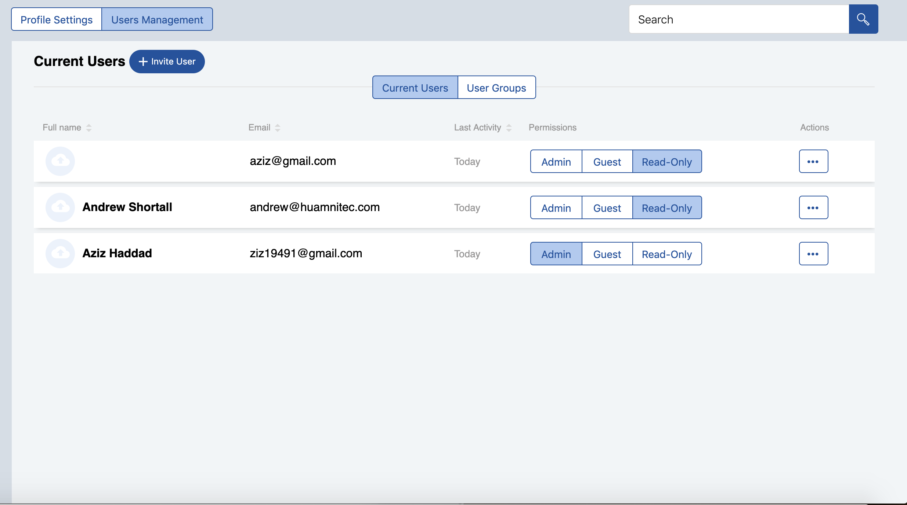
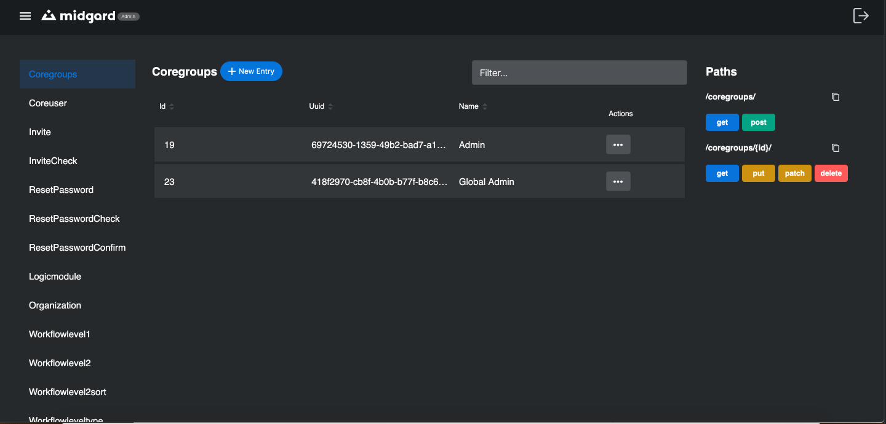

+++
title = "Midgard-Angular"
aliases = [
  "/walhall/midgard/midgard-angular"
]
+++

# Midgard-Angular

## Overview

Midgard-Angular is a customizable web application that provides an interface for the [logic modules](https://docs.walhall.io/library#about-logic-modules) in your [Walhall](https://docs.walhall.io/walhall) application.

When you add Midgard to your Walhall application and set the frontend stack to Angular, Walhall will fork Midgard-Angular to your GitHub account and give it the same name as your application. If your application includes [BiFrost](https://docs.walhall.io/bifrost), then Midgard-Angular will be pre-configured to communicate with the API gateway.

When you deploy your application in Walhall, you can access the application by clicking the **frontend URL** on the application page.

Midgard-Angular consists of two main sections: 

1.  the [application itself](#frontend-application-features), which contains the interface and the core migard modules and tools, and
2.  the [admin section](#midgard-admin-the-dev-tools), where a super user can manage entries, check the paths and possible HTTP operations of each endpoint. 

Both of these use [Freyja](https://docs.walhall.io/midgard/freyja) UI components.

Current Angular version: **v7.2.13**

## Setup

### Initialize the application

Install the npm packages and then initialize the application:

```bash
npm install --save-dev
npm run init
```

The second command will initialize the [Midgard-schematics](https://docs.walhall.io/midgard/midgard-schematics) Gulp task. Midgard-schematics injects the [clients](https://docs.walhall.io/library#about-logic-modules) into the application as dependencies and puts together the UI based on their features and the core Midgard features.

### Build application

To build the application:

```bash
ng build
```

The build artifacts will be stored in the `/dist` directory. Use the `--prod` flag for a production build.

### Run development server

To start a development server: 

```bash
ng serve
```

The default location is [http://localhost:4200](http://localhost:4200). The server will listen for changes to the source code and update automatically.

### Run unit tests

To execute unit tests via [Karma](https://karma-runner.github.io/):

```bash
ng test
```

### Run end-to-end tests

To execute end-to-end tests via [Protractor](http://www.protractortest.org/):

```bash
ng e2e
```

## Frontend application features

### File tree

The Midgard-Angular source (`/midgard`) has six main sub-directories: 

- `/components`: Components shared throughout the application.
- `/helpers`: The application's helpers.
- `/modules`: The core modules of Midgard-angular, such as the store, CRUD, http, etc.
- `/pages`: Where you find the user interfaces of the "smart components" of Midgard.
- `/state`: Everything related to the state of the application, such as models, reducers, and epics.
- `/styles`: Global styles for your frontend application
- `/testing`: Helpful classes, mocks, and stubs for testing.

### Core interfaces

Midgard-Angular provides the following core user interfaces:

#### Login screen

Uses the OAuth library from midgard-core for the OAuth password-flow authentication process with BiFrost.

#### Registration screen 

A form where the user can register an account with the application. They will also be redirected to this screen after accepting an invitation from a super user.

#### User management screen

A screen where an administrator can manage users, update their own profile, and handle permissions in the application.




List of actions:

-  Edit user profile
-  Invite a new user
-  List users in the application
-  Delete a user
-  Edit user data
-  Activate/deactivate user
-  Create user groups
-  Manage permissions per user group

#### Settings screen

A screen for configuring application settings.

These can be found under `/src/lib/pages`, and they have routes that are specified in `/src/libmidgard-routing.module.ts`.

### Store module

The store module is a class that initializes the [Redux store](https://redux.js.org/basics/store#store) with the Walhall application's reducers using methods exposed by `redux` from `midgard-core`.

Once initialized, the store has the following methods:

-  `subscribe: (listener: () => void)`: Subscribes to the state.
-  `dispatch: (action: any) => void;`: Dispatches an action.
-  `getState: () => any;`: Gets the current state.

The store also has a property called `observable`, which will return an observable version of the store.

In order to return data from a single reducer instead of the entire state, we made an rxjs pipeable operator that takes a memoized selector of the data you want to return and returns an `Observable` with the requested data.

The signature of the select function:

```typescript
/**
 * Function that returns a stream of the state depending on a given selector.
 * @param {Function} selector - memoized selector
 * @returns {<T>(source: Observable<T>) => Observable<T>}
 */
export const select = (selector: Function) => <T>(source: Observable<T>) => Observable<T>()
```

The store module contains a file called `reducer.utilities.ts`, which offers common CRUD functions to use in reducers.

#### Reducers & Epics

The store module also enables you to combine reducers and provide epics. The reducers and epics will be injected into your application after the [midgard-schematics command](/walhall/midgard/midgard-schematics) (`npm run init`) is executed in the build process. 

Custom reducers can be added to the reducers object under `src/lib/modules/store/store.ts`. Custom epics can be added to the array in this file.

Example:

```javascript
const reducers = {
    apolloReducer,
    topBarReducer,
    coreuserReducer,
    authuserReducer,
    workflowTeamReducer,
    workflowlevel1Reducer,
    workflowlevel2Reducer
    // your reducer goes here
    };
const epics = [
    coreUserEpics,
    authUserEpics,
    workflowteamsEpics,
    workflowlevel1Epics,
    workflowlevel2Epics
    // your epic goes here
    ]
```

### HttpService

Midgard-Angular implements the Midgard HTTP client as the `HttpService`. The main function of the `HttpService` is the `makeRequest` function:

```typescript
  /**
   * function to send a Http request to the API
   * @param {string} method - Http verb of the request (GET,POST,PUT,...)
   * @param {string} url - url endpoint to send request to e.g ‘contacts’
   * @param {any} body - data of the request
   * @param {booelan} useJwt - boolean to check if we want to use JWT or not
   * @param {string} contentType - type of content to be requested
   * @param {string} responseType - the expected response type from the server
   * @returns {Observable} - response of the request or error
   */
  makeRequest(method: string, url: string, body = null, useJwt?: boolean, contentType?: string, responseType?: string): Observable<any>
```

### CRUD Module

The CRUD module provides basic CRUD operations. It can be implemented either using a UI component or an Angular directive (i.e., in headless mode). You must import `MidgardCrudModule` into your Angular module in order to use this module.

To implement it using the **UI component,** do so as follows:

```javascript
// crud.component.ts
// import the selector
selector = getAllProducts;

cardItemOptions = {
  title: {
    prop: 'name',
    label: 'Product Name'
  },
  subText: {
    prop: 'make',
    label: 'Product Brand'
  },
  link: {
    prop: 'style',
    label: 'Style'
  },
  description: {
    prop: 'description',
    label: 'Description'
  },
  belowMenuPrimaryAction: {
    label: 'New Product',
    value: 'new'
  },
  secondaryAction: {
    label: 'Publish',
    value: 'publish'
  },
};
```

The CRUD module has its own dynamic CRUD redux files that can handle CRUD operations for any endpoint in your app's [BiFrost](https://docs.walhall.io/bifrost) API. 

In order to enable this functionality, you must provide each endpoint and its `id` property (i.e., the key value of the primary key) in the `crud.component.html` file.

Example:

```html
// crud.component.html
<mg-crud-list
    [endpoint]="'coreuser'"
    [idProp]="'id'"
    [title]="'Most recent products'"
    [cardItemOptions]="cardItemOptions"
    [deleteMessage]="'The product has been deleted'"
    [addButtonText]="'Add Product'"
    [detailsRoute]="'/products/details/'"
    [defaultLayout]="'list'"
    (cardItemActionClicked)="handleCardItemActionClicked($event)"
    (cardItemEdited)="handleCardItemEdited($event)"
>
</mg-crud-list>
```

If you prefer to use your own custom redux files, you must provide the actions that perform the CRUD operations and the selector to get the data from the reducer. 

**NOTE: This is currently the only method available.**

```html
<mg-crud-list
    [loadAction]="'LOAD_ALL_PRODUCTS'"
    [title]="'Most recent products'"
    [cardItemOptions]="cardItemOptions"
    [selector]="selector"
    [deleteAction]="'DELETE_PRODUCT'"
    [updateAction]="'UPDATE_PRODUCT'"
    [createAction]="'CREATE_PRODUCT'"
    [deleteMessage]="'The product has been deleted'"
    [addButtonText]="'Add Product'"
    [detailsRoute]="'/products/details/'"
    [defaultLayout]="'list'"
    (cardItemActionClicked)="handleCardItemActionClicked($event)"
    (cardItemEdited)="handleCardItemEdited($event)"
>
</mg-crud-list>
```

To implement it **headlessly,** do so as follows:

-  (Work in progress) Without custom redux files (i.e., by providing only the endpoint):

```html
<div 
    mgCrud
    #crud="mgCrud"
    [endpoint]="'coreuser'"
    [idProp]="'id'"
    [deleteMessage]="'The product has been deleted'"
    *ngFor="row of crud.rows">
        <span> I am an element of the crud module rows </span>
        <!-- delete item using delete function of the the crud module -->
        <button (click)="mgCrud.deleteItem(row)">Delete</button>
</div>
```

-  With custom redux files:

```html
<div 
    mgCrud
    #crud="mgCrud"
    [loadAction]="'LOAD_ALL_PRODUCTS'"
    [deleteAction]="'DELETE_PRODUCT'"
    [updateAction]="'UPDATE_PRODUCT'"
    [createAction]="'CREATE_PRODUCT'"
    [selector]="selector"
    [deleteMessage]="'The product has been deleted'"
    *ngFor="row of crud.rows">
        <span> I am an element of the crud module rows </span>
        <!-- delete item using delete function of the the crud module -->
        <button (click)="mgCrud.deleteItem(row)">Delete</button>
</div>
```

### Translation module

The translation module lets you internationalize your Walhall application. It uses the Angular package `ngx-translate` with a custom loader that connects to the BiFrost API using the [HttpService](#httpservice). It pulls the translation values from a JSON file found under `/assets/translations`.

In order to use it in your HTML template, you must import `MidgardTranslationModule`. You must also define your translations in `src/assets/i18n/lang.json` and then use the translate pipe as follows:

```html
<span>{{'HELLO' | translate}}</span>
```

### OAuth module

The OAuth module connects to the OAuth implementation in midgard-core and provides functionalities related to authentication, e.g., logging in using the password flow, logging out, retrieving and saving the access token.

## Midgard-Admin (The dev tools)

Midgard-Admin offers dev tools to check BiFrost API paths and to manage entries for different endpoints. 

### Main interface

Only super users can access this section. The URL is `https://{your-midgard-URL}/admin-panel`.

The **right section** contains a list of all the endpoints available via BiFrost that can be used as navigation elements, as well as the possible paths and HTTP operations that they accept.

The **middle section** displays CRUD operations on a specific endpoint.

When you click on one of the HTTP verbs, an overlay opens with detailed information about the endpoint API definition.



## License

Copyright &#169;2019 Humanitec GmbH.

This code is released under the Humanitec Affero GPL. See the **LICENSE** file for details.
