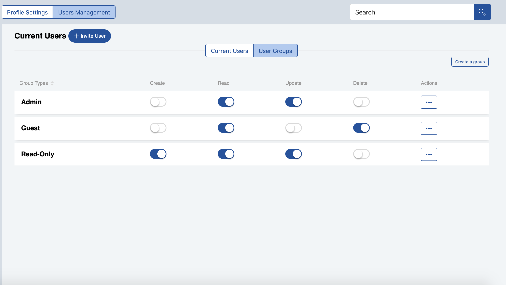

+++
title = "Midgard-Angular"
+++

# Midgard-Angular

## Summary

Midgard-Angular is an [Angular](https://angularjs.org/) web application that implements the core features of [Midgard](https://docs.walhall.io/walhall/midgard).

Midgard-Angular is your **application root repository.** When you create a [Walhall application](https://docs.walhall.io/walhall), Walhall forks Midgard-Angular to your GitHub account and gives it the same name as your application. It comes pre-configured to communicate with your application's API via [BiFrost](https://docs.walhall.io/walhall/bifrost). This is where you develop your Walhall application.

Current Angular version: **v7.2.13**

## Setup

### Initialize the application

Install the npm packages and then initialize the application:

```bash
npm install --save-dev
npm run init
```

The second command will initialize the [Midgard-schematics](https://docs.walhall.io/midgard/midgard-schematics) Gulp task. Midgard-schematics injects the [clients](https://docs.walhall.io/marketplace#what-are-logic-modules) into the application as dependencies and puts together the UI based on their features and the core Midgard features.

### Build application

To build the application:

```bash
ng build
```

The build artifacts will be stored in the `/dist` directory. Use the `--prod` flag for a production build.

### Run development server

To start a development server: 

```bash
ng serve
```

The default location is [http://localhost:4200](http://localhost:4200). The server will listen for changes to the source code and update automatically.

### Run unit tests

To execute unit tests via [Karma](https://karma-runner.github.io/):

```bash
ng test
```

### Run end-to-end tests

To execute end-to-end tests via [Protractor](http://www.protractortest.org/):

```bash
ng e2e
```

## Features

### File tree

The Midgard-Angular source has six main sub-directories: 

- `/components`: Components shared throughout the application.
- `/helpers`: The application's helpers.
- `/modules`: The core modules of Midgard-angular, such as the store, CRUD, http, etc.
- `/pages`: Where you find the user interfaces of the "smart components" of Midgard.
- `/state`: Everything related to the state of the application, such as models, reducers, and epics.
- `/testing`: Helpful classes, mocks, and stubs for testing.

### Core interfaces

Midgard-Angular provides the following core user interfaces:

#### Login screen 

Uses the OAuth library from midgard-core for the OAuth password-flow authentication process with BiFrost.

- **Register screen:** A form where the user can register an account with the application. They will also be redirected to this screen after accepting an invitation from a super user.

#### User management

A screen where an administrator can manage users, update their own profile, and handle permissions in the application.





**List of actions:**

-  Edit User Profile
-  Invite a new user by clicking;
-  List users in the application
-  Delete a user
-  Edit user data
-  Affect a user to a user group to handle permissions
-  Deactivate/ Activate User
-  Create User groups
-  Manage permissions per user group


- **Settings:** A screen for configuring application settings.

These can be found under `/src/lib/pages`, and they have routes that are specified in `/src/libmidgard-routing.module.ts`.

### Store module

The store module is a class that initializes the [Redux store](https://redux.js.org/basics/store#store) with the Walhall application's reducers using methods exposed by `redux` from `midgard-core`.

Once initialized, the store has the following methods:

-  `subscribe: (listener: () => void)`: Subscribes to the state.
-  `dispatch: (action: any) => void;`: Dispatches an action.
-  `getState: () => any;`: Gets the current state.

The store also has a property called `observable`, which will return an observable version of the store.

In order to return data from a single reducer instead of the entire state, we made an rxjs pipeable operator that takes a memoized selector of the data you want to return and returns an `Observable` with the requested data.

The signature of the select function:

```typescript
/**
 * Function that returns a stream of the state depending on a given selector.
 * @param {Function} selector - memoized selector
 * @returns {<T>(source: Observable<T>) => Observable<T>}
 */
export const select = (selector: Function) => <T>(source: Observable<T>) => Observable<T>()
```

The store module contains a file called `reducer.utilities.ts`, which offers common CRUD functions to use in reducers.

#### Reducers & Epics

The store module also enables you to combine reducers and provide epics. The reducers and epics will be injected into your application after the [midgard-schematics command](/walhall/midgard/midgard-schematics) (`npm run init`) is executed in the build process. 

Custom reducers can be added to the reducers object under `src/lib/modules/store/store.ts`. Custom epics can be added to the array in this file.

Example:

```javascript
const reducers = {
    apolloReducer,
    topBarReducer,
    coreuserReducer,
    authuserReducer,
    workflowTeamReducer,
    workflowlevel1Reducer,
    workflowlevel2Reducer
    // your reducer goes here
    };
const epics = [
    coreUserEpics,
    authUserEpics,
    workflowteamsEpics,
    workflowlevel1Epics,
    workflowlevel2Epics
    // your epic goes here
    ]
```

### HttpService

Midgard-Angular implements the Midgard HTTP client as the `HttpService`. The main function of the `HttpService` is the `makeRequest` function:

```typescript
  /**
   * function to send a Http request to the API
   * @param {string} method - Http verb of the request (GET,POST,PUT,...)
   * @param {string} url - url endpoint to send request to e.g ‘contacts’
   * @param {any} body - data of the request
   * @param {booelan} useJwt - boolean to check if we want to use JWT or not
   * @param {string} contentType - type of content to be requested
   * @param {string} responseType - the expected response type from the server
   * @returns {Observable} - response of the request or error
   */
  makeRequest(method: string, url: string, body = null, useJwt?: boolean, contentType?: string, responseType?: string): Observable<any>
```

### CRUD Module

The CRUD module provides basic CRUD operations. It can be implemented either using a UI component or an Angular directive (i.e., in headless mode). You must import `MidgardCrudModule` into your Angular module in order to use this module.

To implement it using the **UI component,** do so as follows:

```javascript
// crud.component.ts
// import the selector
selector = getAllProducts;

cardItemOptions = {
  title: {
    prop: 'name',
    label: 'Product Name'
  },
  subText: {
    prop: 'make',
    label: 'Product Brand'
  },
  link: {
    prop: 'style',
    label: 'Style'
  },
  description: {
    prop: 'description',
    label: 'Description'
  },
  belowMenuPrimaryAction: {
    label: 'New Product',
    value: 'new'
  },
  secondaryAction: {
    label: 'Publish',
    value: 'publish'
  },
};
```


The crud module comes with its own dynamic crud redux files that can be used to handle crud operations for any endpoint using bifrost, this is perfect if you don't need to create any custom redux files for each endpoint. to make it function that way you need to provide it with the endpoint, the id property(the key value of the primary key) like follows. *Work in Progress*

```html
// crud.component.html
<mg-crud-list
    [endpoint]="'coreuser'"
    [idProp]="'id'"
    [title]="'Most recent products'"
    [cardItemOptions]="cardItemOptions"
    [deleteMessage]="'The product has been deleted'"
    [addButtonText]="'Add Product'"
    [detailsRoute]="'/products/details/'"
    [defaultLayout]="'list'"
    (cardItemActionClicked)="handleCardItemActionClicked($event)"
    (cardItemEdited)="handleCardItemEdited($event)"
>
</mg-crud-list>
```
or if you prefer using custom redux files you have to provide the actions that does the crud operations and the selector to get the data from the reducer as follows: *Only this method is currently available*

<mg-crud-list
    [loadAction]="'LOAD_ALL_PRODUCTS'"
    [title]="'Most recent products'"
    [cardItemOptions]="cardItemOptions"
    [selector]="selector"
    [deleteAction]="'DELETE_PRODUCT'"
    [updateAction]="'UPDATE_PRODUCT'"
    [createAction]="'CREATE_PRODUCT'"
    [deleteMessage]="'The product has been deleted'"
    [addButtonText]="'Add Product'"
    [detailsRoute]="'/products/details/'"
    [defaultLayout]="'list'"
    (cardItemActionClicked)="handleCardItemActionClicked($event)"
    (cardItemEdited)="handleCardItemEdited($event)"
>
</mg-crud-list>

To implement it **headlessly,** do so as follows:

- without custom redux files (only by providing the endpoint) *Work in Progress*

```html
<div 
    mgCrud
    #crud="mgCrud"
    [endpoint]="'coreuser'"
    [idProp]="'id'"
    [deleteMessage]="'The product has been deleted'"
    *ngFor="row of crud.rows">
        <span> I am an element of the crud module rows </span>
        <!-- delete item using delete function of the the crud module -->
        <button (click)="mgCrud.deleteItem(row)">Delete</button>
</div>
```

- custom redux files *Only this method is currently available*

```html
<div 
    mgCrud
    #crud="mgCrud"
    [loadAction]="'LOAD_ALL_PRODUCTS'"
    [deleteAction]="'DELETE_PRODUCT'"
    [updateAction]="'UPDATE_PRODUCT'"
    [createAction]="'CREATE_PRODUCT'"
    [selector]="selector"
    [deleteMessage]="'The product has been deleted'"
    *ngFor="row of crud.rows">
        <span> I am an element of the crud module rows </span>
        <!-- delete item using delete function of the the crud module -->
        <button (click)="mgCrud.deleteItem(row)">Delete</button>
</div>
```

### Translation module

The translation module lets you internationalize your Walhall application. It uses the Angular package `ngx-translate` with a custom loader that connects to the BiFrost API using the [HttpService](#httpservice). It pulls the translation values from a JSON file found under `/assets/translations`.

In order to use it in your HTML template, you must import `MidgardTranslationModule`. You must also define your translations in `src/assets/i18n/lang.json` and then use the translate pipe as follows:

```html
<span>{{'HELLO' | translate}}</span>
```

### OAuth module

The OAuth module connects to the OAuth implementation in midgard-core and provides functionalities related to authentication, e.g., logging in using the password flow, logging out, retrieving and saving the access token.

## License

Copyright &#169;2019 Humanitec GmbH.

This code is released under the Humanitec Affero GPL. See the **LICENSE** file for details.
